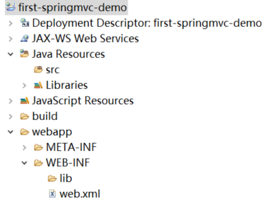

# #Spring系学习笔记


## ##SpringFrameWork

##### 	特点：

​		<u>方便解耦，简化开发。方便继承各种优秀框架。降低java ee API的使用难度。方便程序的测试。支持AOP面向切面编程。声明式事务的支持。</u>

​		<u>可以满足一切企业级应用开发的需求。</u>

------

##### 	Spring FrameWork结构：

​		<u>Test：</u>测试模块，支持TestNG和Junit测试框架，以及一些基于Spring的测试功能。

​		<u>Core Container：</u>Spring核心容器模块，是其他模块的基础。包含：

​			Beans：Spring框架的基础支持部分，包含IOC（控制反转）以及DI（依赖注入）。

​			Core：Spring框架的核心底层部分，封装了Spring的底层实现，包括资源访问、类型转换和一些常用工具类。

​			Context：上下文支持部分。建立在Core和Beans的基础上，集成 Beans 模块功能并添加资源绑定、数据验证、国际化、Java EE 支持、容器生命周期、事件传播等。ApplicationContext 接口是上下文部分的焦点。

​			SpEL：表达式支持部分。

​		<u>AOP、Aspects、Instrumentation与Messaging：</u>建立在在Core Container 之上的模块。包含：

​				AOP：面向切面编程支持部分。

​				Aspect：提供与Aspect的集成的支持，Aspect是一个强大且成熟的AOP框架。

​				Instrumentation：类工具和类加载器实现的支持部分，可以在特定的应用中使用。

​				messaging：Spring 4.0 以后新增了对于消息（Spring-messaging）的支持部分，提供了对消息传递体系结构和协议的支持。

​		<u>Data Access/Intergration：</u>数据访问与集成模块。包含：

​				JDBC：提供了一个JDBC的样例模板，简化了JDBC的使用难度，同时附加了Spring事务管理的优势。

​				ORM：提供了对于“对象-关系”映射框架无缝集成的API，包括 JPA、JDO、Hibernate 和 MyBatis 等。可以使用Spring事务管理。

​				OXM：提供了对于Object/XML映射的抽象层实现，如 JAXB、Castor、XMLBeans、JiBX 和 XStream。用来将 Java 对象映射成 XML 数据，或者将XML 数据映射成 Java 对象。

​				JMS：指 Java 消息服务，提供一套 “消息生产者、消息消费者”模板用于更加简单的使用 JMS，JMS 用于用于在两个应用程序之间，或分布式系统中发送消息，进行异步通信。

​				Transaction：对于编程和声明式事务管理的支持部分。

​		<u>Web：</u>Web层模块。包含：

​				Web：对于基本的 Web 开发集成和支持的部分，例如多文件上传功能、使用的 Servlet 监听器的 IOC 容器初始化以及 Web 应用上下文。

​				Servlet：提供了一个 Spring MVC Web 框架实现。Spring MVC 框架提供了基于注解的请求资源注入、更简单的数据绑定、数据验证等及一套非常易用的 JSP 标签，完全无缝与 Spring 其他技术协作。

​				WebSocket ：提供了简单的接口，用户只要实现响应的接口就可以快速的搭建 WebSocket Server，从而实现双向通讯。

​				Portlet ：提供了在 Portlet 环境中使用 MVC 实现，类似 Web-Servlet 模块的功能。

------

##### 	开发环境及Spring FrameWork框架目录结构：

​		<u>Spring FrameWork。https://repo.spring.io/ui/native/release/org/springframework/spring/</u>

​			主要目录结构：

​				docs文件夹:Spring 的 API 文档和开发规范。

​				libs文件夹：开发需要的 jar 包和源码包。

​				schema文件夹：开发所需要的 schema 文件，在这些文件中定义了 Spring 相关配置文件的约束。

​		<u>JDK环境及JDK环境变量配置。</u>

​		<u>IDE配置。</u>

​		<u>Common Logging 是使用 Spring 的必要组件，用来处理日志信息。https://commons.apache.org/proper/commons-logging/download_logging.cgi</u>

​		<u>Spring FrameWork中的libs文件夹中的spring-core-x.x.xx.jar、spring-beans-x.x.xx.jar、spring-context-x.x.xx.jar、spring-expression-x.x.xx.jar以及Common Logging中的 commons-logging-x.x.jar五个jar包是Spring应用运行所需的依赖。需要复制到项目的lib目录，并发布到类路径中。</u>

------

##### 	创建Spring程序：

​		<u>创建最简单的java项目（暂时不使用jdk9+的模块功能，不创建module-info.java文件）；</u>

​		<u>添加5个核心jar包至resourse文件夹并发布到类路径中；</u>

​		<u>创建java类，创建配置文件xxx.xml（eg：Beans.xml）；</u>

​		<u>运行程序；</u>

------

##### 	IoC（控制反转）：		

​		<u>Spring 通过 IoC 容器来管理所有 Java 对象的实例化和初始化，控制对象与对象之间的依赖关系。我们将由 IoC 容器管理的 Java 对象称为 Spring Bean，它与使用关键字 new 创建的 Java 对象没有任何区别。IoC 带来的最大改变不是代码层面的，而是从思想层面上发生了“主从换位”的改变。原本调用者是主动的一方，它想要使用什么资源就会主动出击，自己创建。但在 Spring 应用中，IoC 容器掌握着主动权，调用者则变成了被动的一方，被动的等待 IoC 容器创建它所需要的对象（Bean）。这个过程在职责层面发生了控制权的反转，把原本调用者通过代码实现的对象的创建，反转给 IoC 容器来帮忙实现，因此我们将这个过程称为 Spring 的“控制反转”。</u>

​		<u>DI（依赖注入）：</u>控制反转核心思想就是由 Spring 负责对象的创建。在对象创建过程中，Spring 会自动根据依赖关系，将它依赖的对象注入到当前对象中，这就是所谓的“依赖注入”。依赖注入本质上是 [Spring Bean 属性注入](http://c.biancheng.net/spring/attr-injection.html)的一种，只不过这个属性是一个对象属性而已。

​		<u>IoC容器：</u>IoC 思想基于 IoC 容器实现的，IoC 容器底层其实就是一个 Bean 工厂。Spring 框架为我们提供了两种不同类型 IoC 容器，它们分别是 BeanFactory 和 ApplicationContext。

​			BeanFactory ：是 IoC 容器的基本实现，也是 Spring 提供的最简单的 IoC 容器，它提供了 IoC 容器最基本的功能，由org.springframework.beans.factory.BeanFactory 接口定义。BeanFactory 采用懒加载（lazy-load）机制，容器在加载配置文件时并不会立刻创建 Java 对象，只有程序中获取（使用）这个对对象时才会创建。 BeanFactory 是 Spring 内部使用接口，通常情况下不提供给开发人员使用。 

```java
public static void main(String[] args) {
    BeanFactory context = new ClassPathXmlApplicationContext("Beans.xml");
    HelloWorld obj = context.getBean("helloWorld", HelloWorld.class);
    obj.getMessage();
}
```

​			ApplicationContext：ApplicationContext 是 BeanFactory 接口的子接口，是对 BeanFactory  的扩展。ApplicationContext 在 BeanFactory 的基础上增加了许多企业级的功能，例如  AOP（面向切面编程）、国际化、事务支持等。

​				ApplicationContext 接口有两个常用的实现类：//configLocation 用于指定 Spring 配置文件的名称和位置，如 Beans.xml。
|类名|描述|eg|
| :-------------------------------------------------------- | :----------------------------------------------------------- | :----------------------------------------------------------- |
| ClassPathXmlApplicationContext                            | 加载类路径 ClassPath 下指定的 XML 配置文件，并完成 ApplicationContext 的实例化工作 | ApplicationContext applicationContext = new ClassPathXmlApplicationContext(String configLocation); |
| FileSystemXmlApplicationContext                           | 加载指定的文件系统路径中指定的 XML 配置文件，并完成 ApplicationContext 的实例化工作 | ApplicationContext applicationContext = new FileSystemXmlApplicationContext(String configLocation); |

```java
public static void main(String[] args) {
    //使用 FileSystemXmlApplicationContext 加载指定路径下的配置文件 Bean.xml
    BeanFactory context = new FileSystemXmlApplicationContext("D:\\eclipe workspace\\spring workspace\\HelloSpring\\src\\Beans.xml");
    HelloWorld obj = context.getBean("helloWorld", HelloWorld.class);
    obj.getMessage();
}
```

------

##### Spring Bean的定义：		

​		<u>由 Spring IoC 容器管理的对象称为 Bean，Bean 根据 Spring 配置文件中的信息创建。Spring 配置文件支持两种格式，即 XML 文件格式和 Properties 文件格式:XML 配置文件采用树形结构，结构清晰，相较于 Properties 文件更加灵活。但是 XML 配置比较繁琐，适用于大型的复杂的项目。Properties 配置文件主要以 key-value 键值对的形式存在，只能赋值，不能进行其他操作，适用于简单的属性配置。通常情况下，Spring的配置文件都是XML格式的。</u>

​		<u>XML格式配置文件：</u>XML 配置文件的根元素是 <beans>，该元素包含了多个子元素 <bean>。每一个 <bean> 元素都定义了一个 Bean，并描述了该 Bean 是如何被装配到 Spring 容器中的。

| 属性名称        | 描述                                                         |
| --------------- | ------------------------------------------------------------ |
| id              | Bean 的唯一标识符，Spring IoC 容器对 Bean 的配置和管理都通过该属性完成。id 的值必须以字母开始，可以使用字母、数字、下划线等符号。 |
| name            | 该属性表示 Bean 的名称，我们可以通过 name 属性为同一个 Bean 同时指定多个名称，每个名称之间用逗号或分号隔开。Spring 容器可以通过 name 属性配置和管理容器中的 Bean。 |
| class           | 该属性指定了 Bean 的具体实现类，它必须是一个完整的类名，即类的全限定名。 |
| scope           | 表示 Bean 的作用域，属性值可以为 singleton（单例）、prototype（原型）、request、session 和 global Session。默认值是 singleton。 |
| constructor-arg | <bean> 元素的子元素，我们可以通过该元素，将构造参数传入，以实现 Bean 的实例化。该元素的 index 属性指定构造参数的序号（从 0 开始），type 属性指定构造参数的类型。 |
| property        | <bean>元素的子元素，用于调用 Bean 实例中的 setter 方法对属性进行赋值，从而完成属性的注入。该元素的 name 属性用于指定 Bean 实例中相应的属性名。 |
| ref             | <property> 和 <constructor-arg> 等元素的子元索，用于指定对某个 Bean 实例的引用，即 <bean> 元素中的 id 或 name 属性。 |
| value           | <property> 和 <constractor-arg> 等元素的子元素，用于直接指定一个常量值。 |
| list            | 用于封装 List 或数组类型的属性注入。                         |
| set             | 用于封装 Set 类型的属性注入。                                |
| map             | 用于封装 Map 类型的属性注入。                                |
| entry           | <map> 元素的子元素，用于设置一个键值对。其 key 属性指定字符串类型的键值，ref 或 value 子元素指定其值。 |
| init-method     | 容器加载 Bean 时调用该方法，类似于 Servlet 中的 init() 方法  |
| destroy-method  | 容器删除 Bean 时调用该方法，类似于 Servlet 中的 destroy() 方法。该方法只在 scope=singleton 时有效 |
| lazy-init       | 懒加载，值为 true，容器在首次请求时才会创建 Bean 实例；值为 false，容器在启动时创建 Bean 实例。该方法只在 scope=singleton 时有效 |

------

##### Spring Bean注入属性：

​		<u>将属性注入到 Bean 中的过程，而这属性既可以普通属性，也可以是一个对象（Bean）。主要有构造函数注入和setter方法注入两种方式。</u>

​			构造函数注入：通过 Bean 的带参构造函数实现Bean的属性注入。

​				基本步骤：

​					1，首先在Bean中添加一个有参的构造函数，该有参构造函数的每个参数代表需要注入的属性。

​					2，在Spring的XML配置文件中，通过<beans>的<bean>对bean进行定义。

​					3，在<bean>中使用<constructor-arg>元素，对有参构造函数进行输入参数，要求有参函数有多少个参数就要使用多少个对应的<constructor-arg>元素。

​			setter方法注入：通过 Bean 的 setter 方法，将属性值注入到 Bean 的属性中。在 Spring 实例化 Bean 的过程中，IoC 容器首先会调用默认的构造方法（无参构造方法）实例化 Bean（Java 对象），然后通过 Java 的反射机制调用这个 Bean 的 setXxx() 方法，将属性值注入到 Bean 中。

​				基本步骤：

​						1，在Bean中提供一个默认的无参构造函数（在没有其他的带构造参数的情况下，可省略），并未所有需要注入的属性提供一个setXxx()方法。

​						2，在Spring的XML配置文件中，使用<beans>及其子元素<bean>对Bean进行定义。

​						3，在<bean>元素中使用<property>元素对各个属性进行赋值。

​			短命名空间方式注入：

​				p命名空间注入：p 命名空间是 setter 方式属性注入的一种快捷实现方式。通过它，我们能够以 bean 属性的形式实现 setter 方式的属性注入，而不再使用嵌套的 <property> 元素，以实现简化 Spring 的 XML 配置的目的。

​					基本步骤：

​						1，在配置文件的 <beans> 元素中导入XML 约束：

```xml
xmlns:p="http://www.springframework.org/schema/p"
```

​						2，在导入约束后，可以使用以下形式实现属性注入：

```xml
<bean id="Bean 唯一标志符" class="包名+类名" p:普通属性名="普通属性值" p:对象属性名-ref="对象的引用">
```

​					注意：因为p命名空间是基于setter方法注入的简化，所以有以下要求：

​						必须有setter方法。

​						必须有无参构造函数。

​						在使用p命名空间前，必须先导入p命名空间的XML约束。

​				c命名空间注入：c 命名空间是构造函数注入的一种快捷实现方式。通过它，我们能够以 <bean> 属性的形式实现构造函数方式的属性注入，而不再使用嵌套的 <constructor-arg> 元素，以实现简化 Spring 的 XML 配置的目的。

​					基本步骤：

​						1，在配置文件的 <beans> 元素中导入XML 约束：

```xml
xmlns:c="http://www.springframework.org/schema/c"
```

​						2，在导入约束后，可以使用以下形式实现属性注入：

```xml
<bean id="Bean 唯一标志符" class="包名+类名" c:普通属性名="普通属性值" c:对象属性名-ref="对象的引用">
```

​					注意：因为c命名空间注入是基于构造函数注入的简化，所以有以下要求：

​						必须有对应的带参构造器。

​						在使用c命名空间前，必须先导入c命名空间的XML约束。

------

##### Spring注入内部Bean：

​		<u>将定义在 <bean> 元素的 <property> 或 <constructor-arg> 元素内部的 Bean，称为“内部 Bean”。内部 Bean 都是匿名的，不需要指定 id 和 name 的。即使制定了，IoC 容器也不会将它作为区分 Bean 的标识符，反而会无视  Bean 的 Scope 标签。因此内部 Bean 几乎总是匿名的，且总会随着外部的 Bean 创建。内部 Bean 是无法被注入到它所在的  Bean 以外的任何其他 Bean 的。</u>

​		<u>setter方法注入方式示例：</u>

```xml
<bean id="outerBean" class="……">
	<property name="……" >
		<!-- 定义内部 Bean -->
		<bean class="……">
			<property name="……" value="……" ></property>
   				……
 		</bean>
 	</property>
</bean>
```

​		<u>构造方法注入方式示例：</u>

```xml
<bean id="..." class="...">
	<constructor-arg name="...">
        <!--内部Bean-->
        <bean class="...">
            <constructor-arg name="..." value="..."></constructor-arg>
            ...
        </bean>
    </constructor-arg>
</bean>	
```

------

##### Spring注入集合：

​		<u>在<bean>标签下的<property>标签中，使用<list>，<set>，<map>，<props>标签配置集合元素。</u>	

| 标签    | 说明                                                         |
| :------ | ------------------------------------------------------------ |
| <list>  | 用于注入 list 类型的值，允许重复                             |
| <set>   | 用于注入 set 类型的值，不允许重复                            |
| <map>   | 用于注入 key-value 的集合，其中 key 和 value 都可以是任意类型 |
| <props> | 用于注入 key-value 的集合，其中 key 和 value 都是字符串类型  |

​		<u>示例：</u>

```xml
<beans ....>
	<bean id="n1" class="...."></bean>
    <bean id="a1" class="....">
    <!--<value>标签中不需要加双引号，-->
    <!--使用构造方法注入集合-->
        <constructor-arg name="">
        	<array>
            	<value>....</value>
            </array>
        </constructor-arg>
    <!--以下是使用setter方法注入集合-->
        <!--向集合中注入对象-->
    	<property name="">
        	<array>
            	<ref bean="n1"></ref>
            </array>
        </property>
        <!--向集合中注入普通值-->
        <property>
        	<array>
            	<value>....</value>
            </array>
        </property>
        <!--注入list集合-->
        <property name="">
        	<list>
            	<value>....</value>
            </list>
        </property>
        <!--注入map集合-->
        <property name="">
        	<map>
            	<entry key="...." value="...."></entry>
            </map>
        </property>
        <!--注入set集合-->
        <property name="">
        	<set>
            	<value>....</value>
            </set>
        </property>
    </bean>
</beans>
```

------

##### Spring注入其他类型的属性：

​		<u>注入null值：通过<null/>标签进行注入。</u>			

```xml
<bean id="" class="">
	<property name="">
        <!--注入了null值-->
    	<null/>
    </property>
</bean>
```

​		<u>注入空字符串：Spring 会将属性中空参数直接当作空字符串来处理。</u>

```xml
<bean id="" class="">
    <!--此处 value="" 的形式代表了向Bean中注入空字符串-->
	<property name="...." value=""></property>
</bean>
```

​		<u>注入字面量：在 XML 配置中“<”、“>”、“&”等特殊字符是不能直接保存的，可以使用转义和短字符串的形式输入这类值。</u>

​			转义：

​				注意：

​					1，转义序列字符之间不能有空格。

​					2，转义序列必须以“;”结束。

​					3，单独出现的“&”不会被认为是转义的开始。

​					4，区分大小写。

| 特殊字符 | 转义字符（去掉下横线_后使用） |
| -------- | -------- |
| &        | &_amp;    |
| <        | &_lt;     |
| >        | &_gt;     |
| ＂       | &_quot;   |
| ＇       | &_apos;   |

​				短字符串<![CDATA[]]> ：通过短字符串 <![CDATA[]]> 将包含特殊符号的属性值包裹起来，可以让 XML 解析器忽略对其中内容的解析，以属性原本的样子注入到 Bean 中。

​					注意：

​						1，此部分不能再包含”]]>”。

​						2，不允许嵌套使用。

​						3，“]]>”中不能包含空格或者换行。

```xml
<bean ...>
	<property name="">
    	<value><![CDATA[<c.biancheng.net>]]></value>
        <!--显示 <c.biancheng.net> -->
    </property>
</bean>
```

​		<u>级联属性赋值：在 <bean> 的 <property> 子元素中，为它所依赖的 Bean 的属性进行赋值，这就是所谓的“级联属性赋值”。</u>

​			注意：

​				1，必须存在setter方法。

​				2，必须存在无参构造器（java类中默认是存在的）。

​				3，依赖其他 Bean 的类中，必须提供一个它依赖的 Bean 的 getXxx() 方法。

```xml
<bean ....>
    <!--注入被依赖的Bean-->
	<property name="a1" ref="xx"></property>
    <!--进行级联属性赋值-->
    <property name="a1.n1" value="..."></property>
</bean>
```

------

##### Spring Bean的作用域：

​		<u>默认情况下，所有的 Spring Bean 都是单例的，也就是说在整个 Spring 应用中， Bean 的实例只有一个。我们可以在 <bean> 元素中添加 scope 属性来配置 Spring Bean 的作用范围。</u>

​		<u>Spring5+的6种Scope作用域：</u>

| 作用范围    | 描述                                                         |
| ----------- | ------------------------------------------------------------ |
| singleton   | 默认值，单例模式，表示在 Spring 容器中只有一个 Bean 实例     |
| prototype   | 原型模式，表示每次通过 Spring 容器获取 Bean 时，容器都会创建一个新的 Bean 实例。 |
| request     | 每次 HTTP 请求，容器都会创建一个 Bean 实例。该作用域只在当前 HTTP Request 内有效。 |
| session     | 同一个 HTTP Session 共享一个 Bean 实例，不同的 Session 使用不同的 Bean 实例。该作用域仅在当前 HTTP Session 内有效。 |
| application | 同一个 Web 应用共享一个 Bean 实例，该作用域在当前 ServletContext 内有效。    与 singleton 类似，但 singleton 表示每个 IoC 容器中仅有一个 Bean 实例，而一个 Web 应用中可能会存在多个  IoC 容器，但一个 Web 应用只会有一个 ServletContext，也可以说 application 才是 Web  应用中货真价实的单例模式。 |
| websocket   | websocket 的作用域是 WebSocket ，即在整个 WebSocket 中有效。 |

| 在以上 6 种 Bean 作用域中，除了 singleton 和 prototype 可以直接在常规的 Spring IoC 容器（例如  ClassPathXmlApplicationContext）中使用外，剩下的都只能在基于 Web 的 ApplicationContext  实现（例如 XmlWebApplicationContext）中才能使用，否则就会抛出一个 IllegalStateException 的异常。 |
| ------------------------------------------------------------ |

​		<u>singleton：singleton 是 Spring 容器默认的作用域。当 Bean 的作用域为 singleton 时，Spring IoC 容器中只会存在一个共享的 Bean 实例。这个 Bean  实例将存储在高速缓存中，所有对于这个 Bean 的请求和引用，只要 id 与这个 Bean 定义相匹配，都会返回这个缓存中的对象实例。如果一个 Bean 定义的作用域为 singleton ，那么这个 Bean 就被称为 singleton bean。</u>					

​		<u>示例：</u>				

```xml
<bean id="" class="" scope="singleton"></bean>
```

​		<u>prototype：如果一个 Bean 定义的作用域为 prototype，那么这个 Bean 就被称为 prototype bean。对于 prototype bean 来说，Spring 容器会在每次请求该 Bean 时，都创建一个新的 Bean 实例。Spring IoC 容器对于 prototype bean 的作用就相当于 Java 的 new 操作符。它只负责 Bean 的创建，至于后续的生命周期管理则都是由客户端代码完成的。</u>

​		<u>示例：</u>				

```xml
<bean id="" class="" scope="prototype"></bean>
```

------

##### Spring Bean的声明周期：

​		<u>在java中，使用new关键字实例化后，这个对象就可以使用了，当一个对象长期不被使用时，java会自动进行垃圾回收。在Spring中，Bean的管理方式主要由Bean的作用域来决定：对于singleton作用域的Bean，Spring IoC容器可以精确完整地控制Bean的创建、初始化、销毁等流程。对于prototype作用域的Bean，Spring IoC容器只负责创建，之后的流程交付java系统等进行控制，Spring将不再继续跟踪其生命周期。</u>

​		<u>Spring Bean生命周期的主要流程：</u>	

​			1，实例化。				

​			2，属性赋值。

​			3，初始化。

​			4，使用。

​			5，销毁。

​		<u>Spring Bean生命周期的具体流程：</u>

​			1，Spring启动，查找并加载需要被Spring管理的Bean，对对应的Bean进行实例化。

​			2，对Bean进行属性注入。

​			3，如果Bean实现了BeanNameAware接口，则Spring调用Bean的setBeanName()方法传入当前Bean的id值。

​			4，如果Bean实现了BeanFactoryAware接口，则Spring调用setBeanFactory()方法传入当前工厂实例的引用。

​			5，如果Bean实现了ApplicationContextAware接口，则Spring调用setApplicationContext()方法传入当前ApplicaionContext实例的引用。

​			6，如果Bean实现了BeanPostProcessor接口，则Spring调用该接口的预初始化方法，随后postProcessBeforeInitialization()方法对Bean进行加工操作，此处非常重要，Spring的AOP就是利用此处实现的。

​			7，如果Bean实现了InitializingBean接口，则Spring调用afterPropertiesSet()方法。

​			8，如果在配置文件中通过init-method属性指定了初始化方法，则调用该初始方法。

​			9，如果 BeanPostProcessor 和 Bean 关联，则 Spring 将调用该接口的初始化方法 postProcessAfterInitialization()。此时，Bean 已经可以被应用系统使用了。

​			10，如果在 <bean> 中指定了该 Bean 的作用域为 singleton，则将该 Bean 放入 Spring IoC  的缓存池中，触发 Spring 对该 Bean 的生命周期管理；如果在 <bean> 中指定了该 Bean 的作用域为  prototype，则将该 Bean 交给调用者，调用者管理该 Bean 的生命周期，Spring 不再管理该 Bean。

​			11，如果 Bean 实现了 DisposableBean 接口，则 Spring 会调用 destory() 方法销毁  Bean；如果在配置文件中通过 destory-method 属性指定了 Bean 的销毁方法，则 Spring 将调用该方法对 Bean  进行销毁。

​			12，（可以总结为：启动与实例化--属性注入--判断与调用--（可以使用）--存放与管理后续--销毁）

​		<u>在Spring Bean生命周期中的自定义操作：在 Spring Bean 生命周期的某个特定时刻，指定一些生命周期回调方法完成一些自定义的操作，对 Bean 的生命周期进行管理。分为初始化回调方法和销毁回调方法。通过接口实现、XML配置实现和注解实现进行自定义回调操作。如果一个 Bean 中有多种生命周期回调方法时，优先级顺序为：注解 > 接口 > XML 配置。</u>


​			初始化回调方法：在 Spring Bean 被初始化后调用，执行一些自定义的回调操作。

​			销毁回调方法：在 Spring Bean 被销毁前调用，执行一些自定义的回调操作。


​			通过接口实现：通过实现 InitializingBean 和 DisposableBean 接口，并且重写afterpropertiesSet()和sestroy()方法，指定 Bean 的生命周期回调方法。通常情况下，我们不建议通过这种方式指定生命周期回调方法，这是由于这种方式会导致代码的耦合性过高。

| 回调方式   | 接口             | 方法                 | 说明                                                         |
| ---------- | ---------------- | -------------------- | ------------------------------------------------------------ |
| 初始化回调 | InitializingBean | afterPropertiesSet() | 指定初始化回调方法，这个方法会在 Spring Bean 被初始化后被调用，执行一些自定义的回调操作。 |
| 销毁回调   | DisposableBean   | destroy()            | 指定销毁回调方法，这个方法会在 Spring Bean 被销毁前被调用，执行一些自定义的回调操作。 |

​			通过XML配置实现：在 Spring 的 XML 配置中，通过 <bean> 元素中的 init-method 和 destory-method 属性，指定 Bean 中的生命周期回调方法。

| XML 配置属性   | 描述                                                         |
| -------------- | ------------------------------------------------------------ |
| init-method    | 指定初始化回调方法，这个方法会在 Spring Bean 被初始化后被调用，执行一些自定义的回调操作。 |
| destory-method | 指定销毁回调方法，这个方法会在 Spring Bean 被销毁前被调用，执行一些自定义的回调操作。 |

​			通过注解实现：可以通过 JSR-250 的 @PostConstruct 和 @PreDestroy 注解，指定 Bean 的生命周期回调方法。

| 注解           | 描述                                                         |
| -------------- | ------------------------------------------------------------ |
| @PostConstruct | 指定初始化回调方法，这个方法会在 Spring Bean 被初始化后被调用，执行一些自定义的回调操作。 |
| @PreDestroy    | 指定销毁回调方法，这个方法会在 Spring Bean 被销毁前被调用，执行一些自定义的回调操作。 |

------

##### Spring后置处理器：

​		<u>即BeanPostProcessor接口，通过实现该接口可以自定义调用初始化前后执行的操作方法。</u>	

​		<u>源码：</u>			

```java
public interface BeanPostProcessor(){
    //postProcessBeforeInitialization() 方法
    Object postProcessBeforeInitialization(Object bean,String beanName) throw BeanException;
    //在 Bean 实例化，属性注入后，初始化前调用。
    
    //postProcessAfterInitialization() 方法
    Object postProcessAfterInitialization(Object bean,String beanName) throw BeanException;
    //在 Bean 实例化、属性注入、初始化都完成后调用。
}
```

​		<u>当需要添加多个后置处理器实现类时，默认情况下 Spring 容器会根据后置处理器的定义顺序来依次调用。也可以通过实现 Ordered 接口的 getOrder 方法指定后置处理器的执行顺序。该方法返回值为整数，默认值为 0，取值越大优先级越低。</u>

------

##### Spring Bean继承：

​		<u>Spring Bean 的定义中可以包含很多配置信息，例如构造方法参数、属性值。子 Bean 既可以继承父 Bean 的配置数据，也可以根据需要重写或添加属于自己的配置信息。在 Spring XML 配置中，我们通过子 Bean 的 parent 属性来指定需要继承的父 Bean。</u>		

```xml
<bean id="" class="C1"></bean>
<bean id="" class="C2" parent="C1"></bean>
```

​		<u>Bean定义模板（抽象Bean），在父Bean的定义中，如果abstract属性为true，这个父Bean就是抽象Bean。抽象的父 Bean 只能作为模板被子 Bean 继承，它不能实例化，也不能被其他 Bean 引用，更不能在代码中根据 id 调用 getBean() 方法获取，否则就会返回错误。在父 Bean 的定义中，既可以指定 class 属性，也可以不指定 class 属性。如果父 Bean 定义没有明确地指定 class 属性，那么这个父 Bean 的 abstract 属性就必须为 true，即该父Bean必须为抽象Bean，子类会利用id属性而不是class属性来找到抽象父Bean。</u>

```xml
<bean id="ID_1" abstract="true">...</bean>
<bean id="ID_2" class="" parent="ID_1"></bean>
```

------

##### Spring自动装配：

​		<u>我们把 Spring 在 Bean 与 Bean 之间建立依赖关系的行为称为“装配”。Spring 的 IOC 容器虽然功能强大，但它本身不过只是一个空壳而已，它自己并不能独自完成装配工作。需要我们主动将 Bean 放进去，并告诉它 Bean 和 Bean 之间的依赖关系，它才能按照我们的要求完成装配工作。相对的，手动配置是指类似于在 XML 配置中通过 <constructor-arg>和 <property> 中的 ref 属性，手动维护 Bean 与 Bean 之间的依赖关系。</u>

​		<u>Spring 的自动装配功能可以让 Spring 容器依据某种规则（自动装配的规则，有五种），为指定的 Bean  从应用的上下文（AppplicationContext 容器）中查找它所依赖的 Bean，并自动建立 Bean  之间的依赖关系。而这一过程是在完全不使用任何 <constructor-arg>和 <property> 元素 ref  属性的情况下进行的。Spring 的自动装配功能能够有效地简化 Spring 应用的 XML 配置，因此在配置数量相当多时采用自动装配降低工作量。</u>

​		<u>Spring 框架式默认不支持自动装配的，要想使用自动装配，则需要对 Spring XML 配置文件中 <bean> 元素的 autowire 属性进行设置。</u>

```xml
<!--ID_1 的 Bean 定义-->
<bean id="ID_1" class=""></bean>
<!--ID_2 的 Bean 定义,通过 autowire 属性设置自动装配的规则-->
<bean id="ID_2" class="" autowrite="byName"></bean>
```

​		<u>自动装配规则：</u>		

​		


​													


------


------

------


## ##SpringMVC

##### SpringMVC：

​		<u>Spring MVC（全称 Spring Web MVC）是 Spring 框架提供的一款基于 MVC 模式的轻量级 Web 开发框架，是 Spring 为表示层（UI）（三层架构模式）开发提供的一整套完备的解决方案。</u>

​		<u>Spring MVC 本质是对 Servlet 的进一步封装，其最核心的组件是 DispatcherServlet，它是 Spring MVC  的前端控制器，主要负责对请求和响应的统一地处理和分发。Controller 接收到的请求其实就是 DispatcherServlet  根据一定的规则分发给它的。Spring MVC 框架内部采用松耦合、可插拔的组件结构，具有高度可配置性，比起其他的 MVC 框架更具有扩展性和灵活性。此外，Spring MVC 的注解驱动（annotation-driven）和对 REST 风格的支持，也是它最具有特色的功能。Spring MVC 是 Spring 框架的众多子项目之一，自 Spring 框架诞生之日起就包含在 Spring 框架中了，它可以与  Spring 框架无缝集成，在性能方面具有先天的优越性。对于开发者来说，Spring MVC 的开发效率要明显高于其它的 Web 框架，因此  Spring MVC 在企业中得到了广泛的应用，成为目前业界最主流的 MVC 框架之一。</u>

​		<u>常用组件：</u>

| 组件              | 提供者       | 描述                                                         |
| ----------------- | ------------ | ------------------------------------------------------------ |
| DispatcherServlet | 框架提供     | 前端控制器，它是整个 Spring MVC 流程控制中心，负责统一处理请求和响应，调用其他组件对用户请求进行处理。 |
| HandlerMapping    | 框架提供     | 处理器映射器，根据请求的 url、method 等信息查找相应的 Handler。 |
| Handler           | 开发人员提供 | 处理器，通常被称为 Controller（控制器）。它可以在 DispatcherServlet 的控制下，对具体的用户请求进行处理。 |
| HandlerAdapter    | 框架提供     | 处理器适配器，负责调用具体的控制器方法，对用户发来的请求来进行处理。 |
| ViewResolver      | 框架提供     | 视图解析器，其职责是对视图进行解析，得到相应的视图对象。常见的视图解析器有 ThymeleafViewResolver、InternalResourceViewResolver 等。 |
| View              | 开发人员提供 | 视图，它作用是将模型（Model）数据通过页面展示给用户。        |

​		<u>特点：</u>

​			Spring MVC 是 Spring 家族原生产品，可以与 IoC 容器等 Spring 基础设施无缝对接；
​			Spring MVC 支持各种视图技术，例如 JSP、Thymeleaf、 JSP 和 FreeMaker 等。 
​			Spring MVC 基于原生的 Servlet 实现，通过功能强大的前端控制器 DispatcherServlet，对请求和响应进行统一处理；
​			Spring MVC 对表示层各细分领域需要解决的问题全方位覆盖，并提供一整套全面的解决方案；
​			代码清新简洁，大幅度提升开发效率；
​			内部组件化程度高，可插拔式组件即插即用，想要使用什么功能，配置相应组件即可；
​			性能卓著，尤其适合现代大型、超大型互联网项目的开发。

------

##### MVC：

​		<u>传统架构模式：</u>


​		<u>三层架构模式：</u>各层之间采用接口相互访问，并通过实体类作为数据传递的载体。不同的实体类一般对应于数据库中不同的数据表，且实体类的属性与数据库表的字段名一一对应 。

​			表示层（UI）：用来实现与用户的交互，接收用户请求，并将请求交给业务逻辑层（BLL）和数据访问层（DAL）进行处理，最后将处理结果返回给用户。包含 HTML、JSP 等前台页面以及后台的 Servlet。

​			业务逻辑层（BLL）：起到承上启下的作用，接收表示层传递来的请求，并针对业务对数据进行处理，以实现业务目标。包含 Service 接口及其实现类（Servicelmpl）的代码。

​			数据访问层（DAL）：用于实现与数据库的交互和访问，例如从数据库中获取数据、保存或修改数据库中的数据等。包含 Dao 接口及其实现类（DaoImpl）的代码。

​		<u>MVC 模式：</u>全称为 Model-View-Controller（模型-视图-控制器）模式，它是一种软件架构模式，其目标是将软件的用户界面（即前台页面）和业务逻辑分离，使代码具有更高的可扩展性、可复用性、可维护性以及灵活性。

​			优点：降低代码耦合性。有利于分工合作。有利于组件的重用。

​			缺点：增加了系统结构的实现与复杂性。视图与控制器之间的联系过于紧密。视图对于模型数据的访问效率低。

| 分层                 | 描述                                                         |
| -------------------- | ------------------------------------------------------------ |
| Model（模型）        | 它是应用程序的主体部分，主要由以下 2 部分组成： <br>实体类 Bean：专门用来存储业务数据的对象，它们通常与数据库中的某个表对应，例如 User、Student 等。 <br>业务处理 Bean：指 Service 或 Dao 的对象，专门用于处理业务逻辑、数据库访问。<br><br> 一个模型可以为多个视图（View）提供数据，一套模型（Model）的代码只需写一次就可以被多个视图重用，有效地减少了代码的重复性，增加了代码的可复用性。 |
| View（视图）         | 指在应用程序中专门用来与浏览器进行交互，展示数据的资源。在 Web 应用中，View 就是我们常说的前台页面，通常由 HTML、JSP、CSS、JavaScript 等组成。 |
| Controller（控制器） | 通常指的是，应用程序的 Servlet。它负责将用户的请求交给模型（Model）层进行处理，并将 Model 层处理完成的数据，返回给视图（View）渲染并展示给用户。<br>在这个过程中，Controller 层不会做任何业务处理，它只是 View（视图）层和 Model （模型）层连接的枢纽，负责调度 View 层和 Model 层，将用户界面和业务逻辑合理的组织在一起，起粘合剂的效果。 |

------

##### 创建SpringMVC程序：

​		<u>执行流程：</u>

​			1，浏览器发送一个请求，若请求地址与 web.xml 中配置的前端控制器（DispatcherServlet）的 url-pattern 相匹配，则该请求就会被前端控制器 DispatcherServlet 拦截。

​			2，前端控制器（DispatcherServlet ）会读取 SpringMVC 的核心配置文件，通过组件扫描获取到所有的控制器（Contorller）。

​			3，将请求信息和控制器中所有控制器方法标识的 @RequestMapping 注解的 value、method 等属性值进行匹配。若匹配成功，则将请求交给对应的 @RequestMapping 注解所标识的控制器方法处理。

​			4，处理请求的方法会返回一个字符串类型的视图名称，该视图名称会被 Spring MVC 配置文件中配置的视图解析器（ViewResolver）解析真正的视图（View）对象，最终展示给客户端。

​		<u>构建流程：</u>

​			1，创建java web项目（以Eclipse下的Dynamic web project为例），并在接下来的创建选项中选择服务器（需提前添加配置）和配置jdk，在创建选项中将Content directory选项修改为webapp，并勾选下方的Generate web.xml deployment descriptor选项，创建java web项目完成后检查项目目录结构是否完整正确。



​			2，导入SpringMVC项目相关依赖，导入位置为 webapp/WEB-INF/lib 目录中，导入后添加依赖至路径中。需要导入的有（）：

​				commons-logging-1.2.jar
​				spring-aop-5.3.13.jar
​				spring-beans-5.3.13.jar
​				spring-context-5.3.13.jar
​				spring-core-5.3.13.jar
​				spring-expression-5.3.13.jar
​				spring-web-5.3.13.jar
​				spring-webmvc-5.3.13.jar

​					其中 spring-web-5.3.13.jar 和 spring-webmvc-5.3.13.jar 是 Spring MVC 的依赖包，其余的则都是 Spring 的核心依赖。

​			3，可选：用以替代单纯的jsp（在SpringMVC项目中仅使用此技术已经被视为落后的）的优秀前端技术：Thymeleaf。如果选用，则需要首先导入Thymeleaf依赖至 webapp/WEB-INF/lib 目录中，，导入后添加依赖至路径中，所需依赖如下（需提前下载备用好）：

​				attoparser-2.0.5.RELEASE.jar
​				slf4j-api-1.7.25.jar
​				thymeleaf-3.0.14.RELEASE.jar
​				thymeleaf-spring5-3.0.14.RELEASE.jar
​				unbescape-1.1.6.RELEASE.jar

​			4，配置DispatcherServlet前端控制器，Spring MVC 是基于 Servlet 的，DispatcherServlet 是整个 Spring MVC 框架的核心，主要负责截获请求并将其分派给相应的处理器处理。跟所有的 Servlet 一样，DispatcherServlet 也需要在 web.xml 中进行配置，它才能够正常工作。Spring MVC 初始化时，会自动从应用程序的 WEB-INF 目录下查找 Spring MVC 的配置文件。该配置文件的默认命名规则为{servlet-name}-servlet.xml。也可以将 Spring MVC 的配置文件存放在应用程序目录中的其他位置，但需要在 <servlet> 元素下通过  <init-param> 元素的 contextConfigLocation 参数，来指定 Spring MVC 配置文件的位置。

​				默认情况下，所有的 Servlet（包括  DispatcherServlet ）都是在第一次调用时才会被加载。这种机制虽然能一定程度上降低项目启动的时间，但却增加了用户第一次访问所需的时间，给用户带来不佳的体验。因此在上面的 web.xml 中，我们通过 <load-on-startup> 标签对 Spring MVC 前端控制器  DispatcherServlet 的初始化时间进行了设置，让它在项目启动时就完成了加载。

​				load-on-startup 元素取值规则如下：它的取值必须是一个整数；当值小于 0 或者没有指定时，则表示容器在该 Servlet 被首次请求时才会被加载；当值大于 0 或等于 0 时，表示容器在启动时就加载并初始化该 Servlet，取值越小，优先级越高；当取值相同时，容器就会自行选择顺序进行加载。

​				通过 <servlet-mapping> 将 DispatcherServlet 映射到“/”，表示 DispatcherServlet 需要截获并处理该项目的所有 URL 请求（以 .jsp 为后缀的请求除外）。

```xml
<!--配置 SpringMVC 的前端控制器，对浏览器发送的请求统一进行处理-->
<!--配置 DispatcherServlet 的一个初始化参数：spring mvc 配置文件按的位置和名称-->
<!--作为框架的核心组件，在启动过程中有大量的初始化操作要做而这些操作放在第一次请求时才执行会严重影响访问速度因此需要通过此标签将启动控制DispatcherServlet的初始化时间提前到服务器启动时-->
<servlet>
	<servlet-name>springMVC</servlet-name>
    <servlet-class>org.springframework.web.servlet.DispatcherServlet</servlet-class>
    <init-param>
    	<param-name>contextConfigLocation</param-name>
        <param-value>classpath:springMVC.xml</param-value>
    </init-param>
    <load-on-startup>1</load-on-startup>
</servlet>
<!--设置springMVC的核心控制器所能处理的请求的请求路径，/所匹配的请求可以是/login或.html或.js或.css方式的请求路径，但是/不能匹配.jsp请求路径的请求-->
<servlet-mapping>
	<servlet-name>dispatcherServlet</servlet-name>
    <url-pattern>/</url-pattern>
</servlet-mapping>
```

​			5，创建SpringMVC配置，在 first-springmvc-demo 项目的 src 目录下，创建一个名为 springMVC.xml 的配置文件，Thymeleaf的视图解析器也在此处配置。在以下的配置中，定义了一个名为 viewResolver，类型为 ThymeleafViewResolver 的 Bean，这其实是 Thymeleaf 的视图解析器。通过它，我们可以对 Thymeleaf 视图的编码、视图前缀、视图后缀等进行配置。

```xml
<!--开启组件扫描-->
<context:component-scan base-package="xx.xx.xx"></context:component-scan>
<!--可选-->
<!--配置Thymeleaf视图解析器-->
<bean id="viewResolver" class="org.thymeleaf.spring5.view.ThymeleafViewResolver">
	<property name="order" value="1"/>
    <property name="charcterEncoding" value="UTF-8"/>
    <property name="templateEngine">
    	<bean class="org.thymeleaf.spring5.SpringTemplateEngine">
        	<property name="templateResolver">
            	<bean class="org.thymeleaf.spring5.templateresolver.SpringResourceTemplateResolver">
                    <!--视图前缀-->
                	<property name="prefix" value="/WEB-INF/templates/"/>
                    <!--视图后缀-->
                    <property name="suffix" value=".html"/>
                    <property name="templateMode" value="HTML5"/>
                    <property name="characterEncoding" value="UTF-8"/>
                </bean>
            </property>
        </bean>
    </property>
</bean>
```

​			6，创建Controller（控制器），在 Spring MVC 中，一个普通的 Java 类只要标注了 @Controller 注解，就会被 Spring MVC 识别成 Controller。Controller 类中的每一个处理请求的方法被称为“控制器方法”。控制器方法在处理完请求后，通常会返回一个字符串类型的逻辑视图名（ViewName），Spring MVC 需要借助ViewResolver（视图解析器）将这个逻辑视图名解析为真正的 View 视图，最终响应给客户端展示。在方法上使用@RequestMapping 注解，的控制器方法关联映射起来，建立映射关系。Spring MVC 的 DispatcherServelt 在拦截到指定的请求后，就会根据这个映射关系将请求分发给指定的控制器方法进行处理。视图是由视图前缀+index+视图后缀组成的。

```java
package xxx;

import org.springframework.stereotype.Controller;
import org.springframework.web.bind.annotation.RequestMapping;

@Controller
public class HelloController{
    @RequestMapping("/")
    public String sayHello(){
        //视图名，即 /WEB-INF/template/index.html
        return "index";
    }
    
    @RequestMapping("/login")
    public String welcome(){
        //视图名，即 /WEB-INF/template/login.html
        return "login";
    }
    
    @RequestMapping("/register")
    public String success(){
        //视图名，即 /WEB-INF/template/register.html
        return "register";
    }
}
```

​			7，创建View（视图），创建相应的前端文件，同时根据 Spring MVC 配置文件中关于 Thymeleaf 视图解析器的配置可知，所有的 Thymeleaf 视图文件都应该存放在 /WEB-INFO/temlpates 目录下且文件名必须以 .html 结尾。

​			8，部署运行，将项目部署到服务器（例如tomcat）中，启动服务器并访问。


------


------

------


## ##SpringBoot

!!

------


------


------

------


## ##SpringCloud

!!

------


------


------

------

